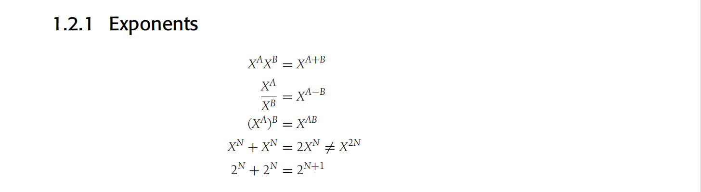
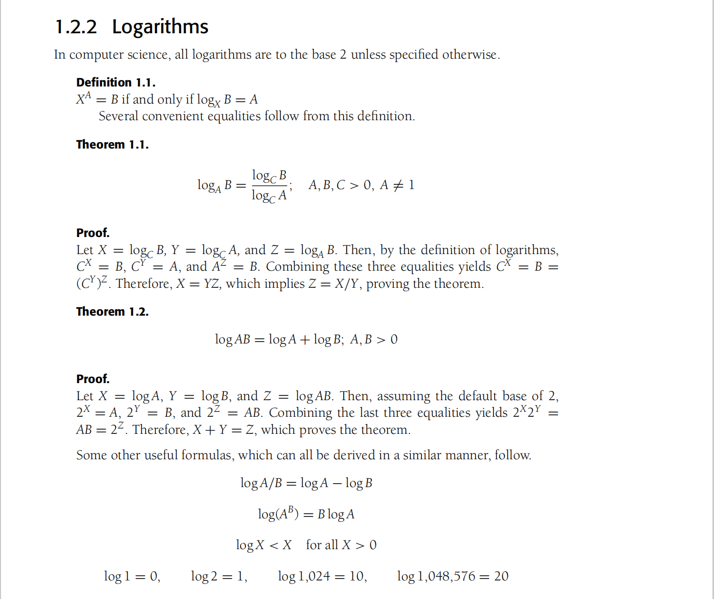
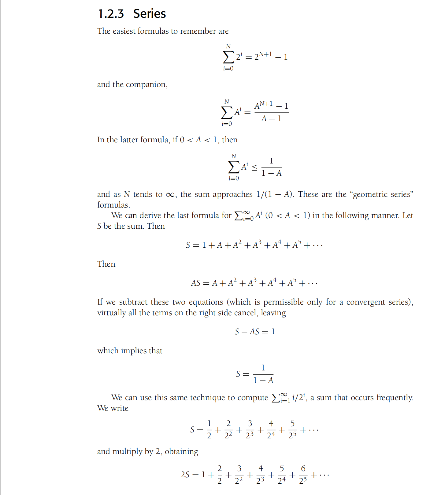
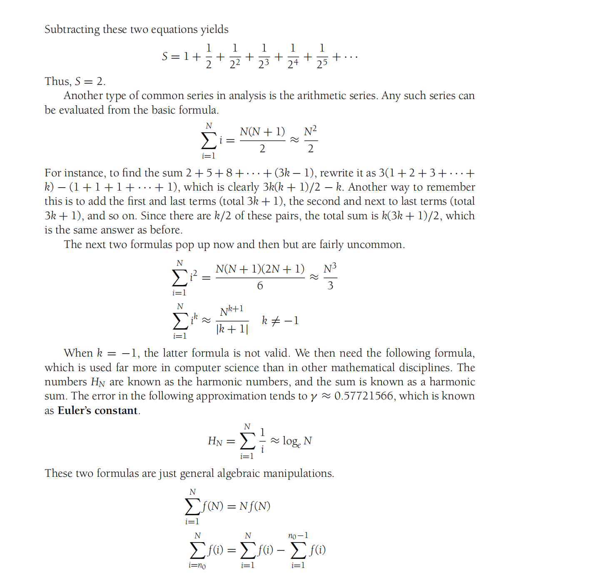
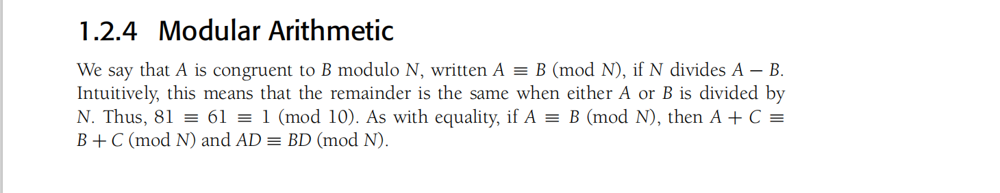
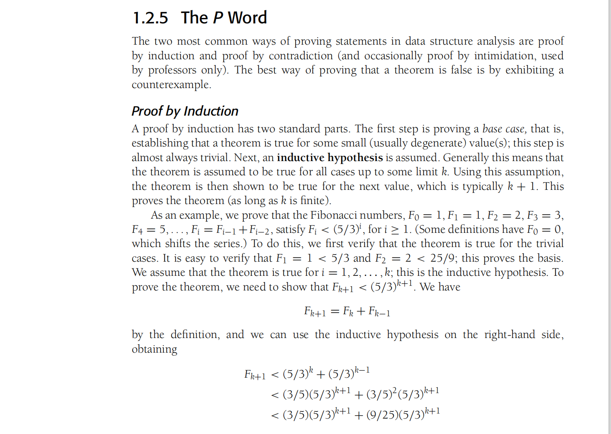
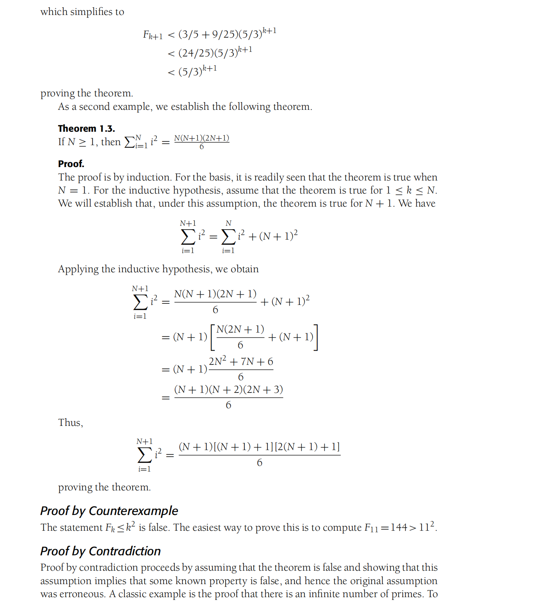
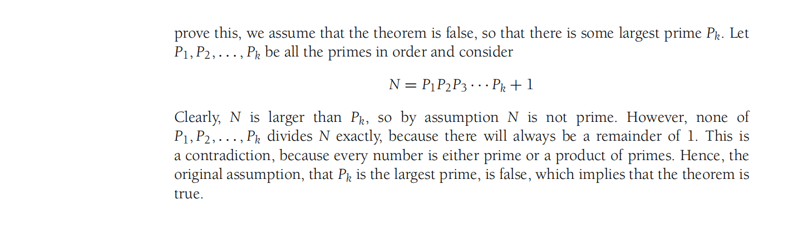

# Data Structures and Algorithm Analysis in Java

## Chapter 1 引论

* 在合理的大量输出下的运行性能 与 在适量输入下的运行性能 的 同等重要性
* 数学基础
* 复习递归
* Java语言的某些重要特点

### 1.1 本书讨论的内容

写出一个能够工作的程序并不够，如果这个程序在巨大的数据集上运行，那么时间就成了重要的问题。

我们将学习对于大量的输入如何估计程序的运行时间，尤其是在尚未具体编码的情况下比较两个程序的运行时间。

我们将看到彻底改进程序速度以及确定程序瓶颈的方法。

### 1.2 数学知识复习

#### 1.2.1 指数

#### 1.2.2 对数

#### 1.2.3 级数

#### 1.2.4 模运算

#### 1.2.5 证明的方法

### 1.3 递归简论

* recursion: 当一个函数的定义包含其本身时，我们称之为递归函数， java允许函数时递归的
* base case: Java的递归方法若无基准情况也是毫无意义的，总归要有某些基准情形，不需要递归即可求解
* making progress: 对于需要进行递归求解的情形，递归调用必须总能朝着一个基准情形推进
* design rule: 假设所有递归调用都能正常运行
* compound interest rule: 求解一个问题的同一实例时，切勿在不同额递归调用中做重复性的工作